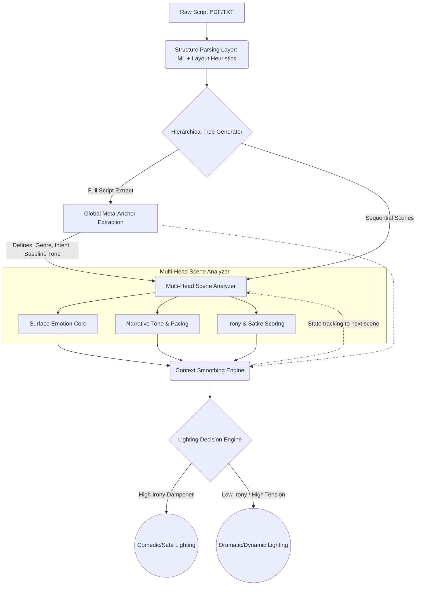

# Narrative-Intelligent Architecture for Theatrical Script Processing

Based on your observations, the core issue with the current system is **Semantic Flattening**—treating highly structured, multi-layered art (scripts) as flat, one-dimensional text arrays. 

Below is a comprehensive architectural redesign to transform your surface-level classifier into a narrative-intelligent system.

---

## 1. Analysis of Current Architecture Failures

*   **The "Literalism" Trap:** Current NLP models are inherently literal. A character yelling "I will destroy you!" is processed with the same vector weight in a Shakespearean tragedy as it is in a Looney Tunes script.
*   **Loss of Meta-Context:** Scripts contain parallel streams of information: *Dialogue* (what is said) and *Stage Directions* (what happens). When these are smashed together and analyzed as one chunk, the model loses the ability to detect juxtaposition (a key driver of comedy).
*   **Context Amnesia:** Processing scenes in isolation prevents the system from recognizing running gags, escalating tension, or structural payoffs.

## 2. Structural Weaknesses in Classification Logic

*   **Single-Dimensional Output:** Forcing a scene into a single label (e.g., `primary_emotion: Anger`) conflates **Character State** (the character is angry) with **Audience Tone** (the scene is funny *because* the character is angry). 
*   **Fragile Parser Dependency:** Relying on simple regex (`INT.`/`EXT.`) ignores the reality of poorly formatted PDFs, theatrical scripts (which rarely use film formatting), and OCR noise.
*   **Lack of Baselines:** The system cannot detect "abnormal" escalation because it never establishes a baseline "normal" for the specific script.

---

## 3. Redesigned Architecture: The Multi-Layered Approach

We must move from a single-pass classifier to a **Multi-Head, Hierarchical Processing Pipeline**.

### Key Additions:
1.  **Hierarchical Narrative Modeling:** Scripts are parsed into a tree structure: `Script -> Act -> Scene -> Beat`.
2.  **Global Anchor:** Before any scene is analyzed, a "Global Intent" profile is generated to act as a definitive anchor for all subsequent classifications.
3.  **Multi-Head Analysis:** Scenes are evaluated on three distinct axes:
    *   **Surface Emotion:** (Character perspective - e.g., Fear)
    *   **Narrative Tone:** (Audience perspective - e.g., Comedy)
    *   **Irony/Absurdity Index:** (A float from 0.0 to 1.0 mapping the divergence between situation and reaction)

---

## 4. Specific Implementation Techniques (Python + Transformers)

### A. Robust Scene Boundary Detection (Rule-Based + ML)
*   **Technique:** Move away from pure regex. Implement a two-pass system:
    1.  **Format Feature Extraction:** Map indentation levels, font sizes, and capitalization density (e.g., character names are usually centered/indented). 
    2.  **ML Validation:** Use a lightweight token classifier (like a fine-tuned BERT/RoBERTa) trained on script segmentation to validate boundaries. If a line is all caps but has no surrounding whitespace and follows mid-sentence dialogue, the ML layer flags it as a false positive (OCR noise).

### B. Global "Anchor" Extraction (LLM-based)
*   **Technique:** Pass the first 20% and last 10% of the script to `gpt-4o-mini` with a structured output prompt to determine the *Meta-Genre* and *Author Intent*. 
*   **Why:** If the anchor is "Absurdist Satire", all subsequent "Danger" signals are heavily discounted.

### C. Irony, Satire, & Comedy Detection (Multi-Label Zero-Shot + Features)
*   **Contradiction Modeling:** Use a semantic model to compare the dialogue against the stage direction. (e.g., Dialogue: "I am dying of grief." Stage Direction: *He slips on a banana peel.*). High semantic divergence = Irony/Comedy.
*   **Pacing Features:** Calculate the "Beat Rate" (number of dialogue exchanges per page). Rapid, short exchanges usually correlate with comedy or high-action, not deep drama.
*   **Zero-Shot Axes:** Instead of asking an LLM "What is the emotion?", ask it to score the scene on continuous axes: 
    *   `[Realistic <---> Hyperbolic]`
    *   `[Sincere <---> Sarcastic]`

### D. Context-Aware Smoothing (State Tracking)
*   **Technique:** Pass the output of `Scene(N-1)` as a system context variable when analyzing `Scene(N)`. If `Scene(N-1)` was an escalating joke, `Scene(N)` is vastly more likely to be the punchline, even if it contains "serious" vocabulary.

---

## 5. Reducing Lighting System Risk

By separating **Tone** from **Emotion**, we build a "Lighting Safety Mechanism."

*   **Scenario:** A character gets violently slapped (Surface Emotion: Pain/Anger, Keywords: "slap", "violently").
*   **Old System:** Reads "violence" -> Triggers Thriller/Drama lighting (harsh red strobes, sharp angles). *Result: Ruins the joke.*
*   **New System:** 
    *   `Surface Emotion: Pain`
    *   `Global Anchor: Slapstick Comedy`
    *   `Irony Index: 0.9` 
*   **Decision Engine Logic:** The high Irony Index acts as a dampener. The engine overrides the "Pain" trigger and defaults to the "Comedy" baseline (bright, flat, warm washes) with perhaps a split-second, absurdly saturated flash for comedic timing.

---

## 6. Upgraded Pipeline Diagram (Mermaid)

---

## 7. Prioritization (Impact vs. Difficulty)

1.  **High Impact / Low Effort: Multi-Head LLM Prompting**
    *   *Action:* Redesign your Phase 2 LLM prompt to output `surface_emotion`, `audience_tone`, and `irony_score` (0.0 - 1.0) simultaneously. 
2.  **High Impact / Low-Med Effort: Global Anchoring**
    *   *Action:* Implement a single initial LLM call to classify the entire script's intent *before* processing individual scenes.
3.  **High Impact / High Effort: Structural ML Parsing**
    *   *Action:* Replace regex boundary detection with a layout-aware parser (e.g., analyzing indentation patterns) to stop OCR noise from breaking scenes.
4.  **Medium Impact / High Effort: Pacing & Contradiction Math**
    *   *Action:* Build Python functions to calculate dialogue speed and cross-reference stage-direction embeddings vs. dialogue embeddings for contradiction.
